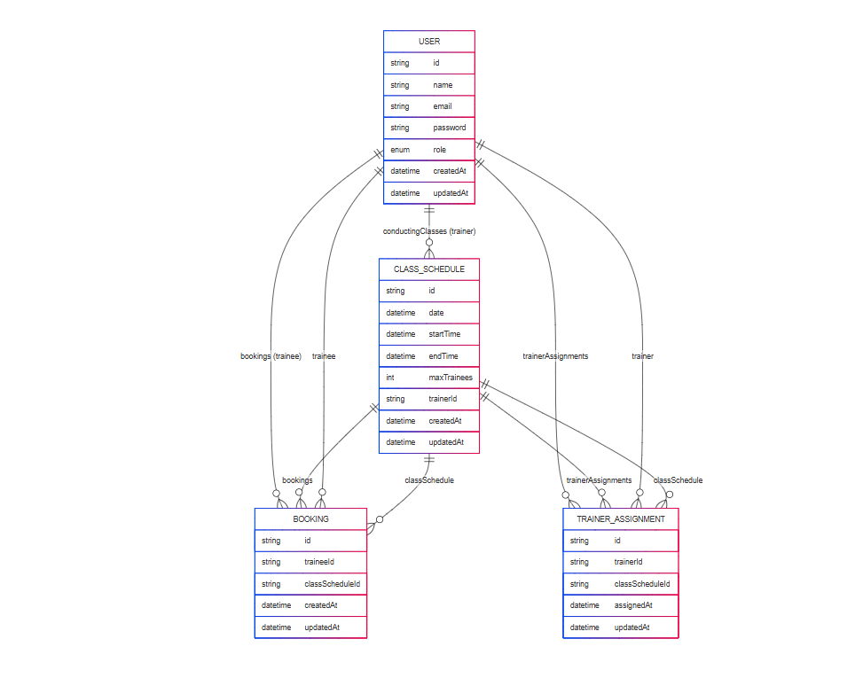

# 🏋️‍♂️ Gym Class Scheduling & Membership Management System

## 📌 Project Overview

This system provides a platform to manage gym class schedules, trainer assignments, trainee bookings, and user roles (Admin, Trainer, Trainee). Admins can create and manage classes, assign trainers, and view bookings. Trainers and trainees can view their own relevant schedules and actions based on roles.

## 🧩 Relation Diagram



## 🚀 Technology Stack

- **Language:** TypeScript
- **Backend:** Node.js, Express.js
- **ORM:** Prisma
- **Database:** MongoDB
- **Authentication:** JWT (JSON Web Token)
- **Runtime:** Node.js

# API Documentation

This document outlines the API endpoints for the Gym Class Scheduling and Membership Management System. The API is built with TypeScript, Node.js, Express, Prisma, and MongoDB. All endpoints are prefixed with `/api`.

## Base URL

[http://localhost:5000/api](http://localhost:5000/api)

## 1. Authentication APIs

### POST /auth/signup

**Description**: Register a new user (Trainee).

**Request Body**:

```json
{
  "name": "string",
  "email": "string",
  "password": "string"
}
```

## Setup Instructions

Follow these steps to set up and run the project locally.

### 1. Clone the Repository

```bash
git clone https://github.com/AIsTushar/gym-management-system
```

```bash
cd gym-management-system
```

### 2. Install Dependencies

```bash
npm install
```

### 3. Configure Environment Variables

```bash
DATABASE_URL="your_mongodb_connection_url"
JWT_SECRET="your_jwt_secret"
PORT=5000
```

### 4. Generate Prisma Client

```bash
npx prisma generate
```

### 5.Push Schema to Database (if needed)

```bash
npx prisma db push
```

### 6. Start the Server

```bash
npm run dev
```

1. Authentication APIs
   -POST /api/auth/signin
   -POST /api/auth/login

2. User Management APIs
   -POST /api/users/trainers
   -GET /api/users/trainers
   -GET /api/users/trainees
   -GET /api/users/profile
   -PUT /api/users/profile

3. Class Scheduling APIs
   -POST /api/schedules
   -GET /api/schedules
   -GET /api/schedules/:id
   -PUT /api/schedules/:id
   -DELETE /api/schedules/:id

4. Booking Management APIs
   -POST /api/bookings
   -GET /api/bookings
   -DELETE /api/bookings/:id

Total APIs: 15 COmpleted APIs:15

```

```
